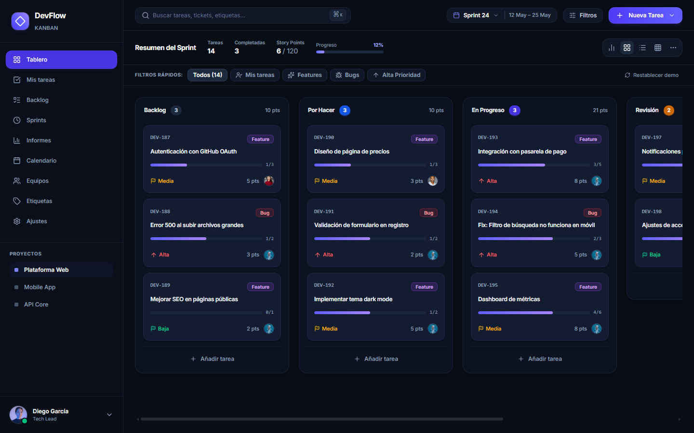
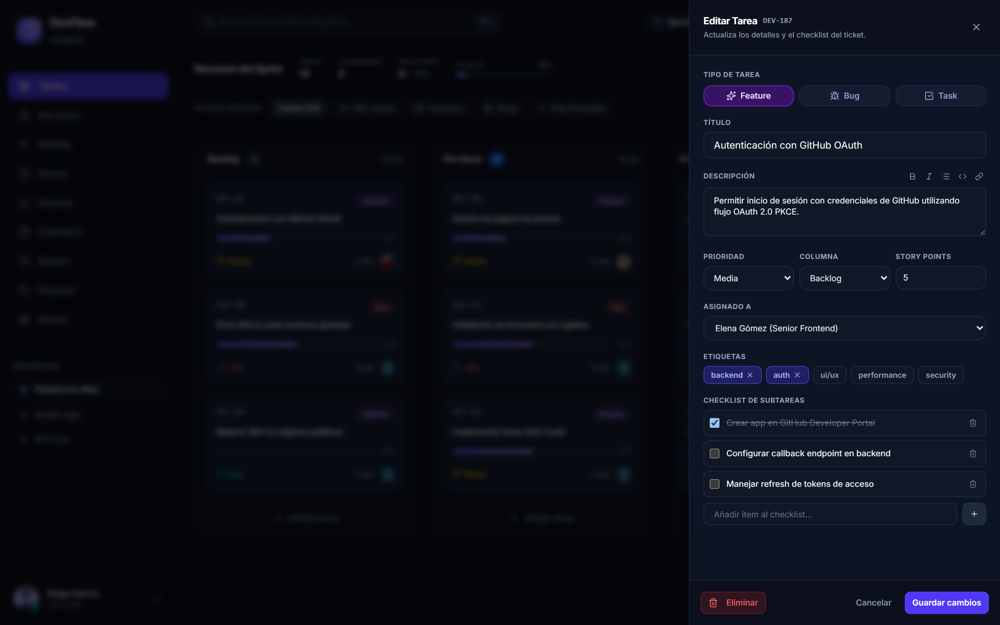
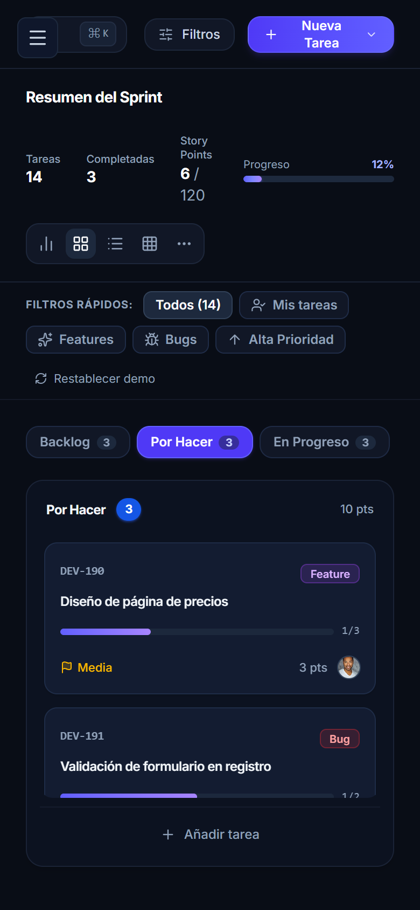

# DevFlow Kanban — Tablero Ágil de Alta Fidelidad

**DevFlow Kanban** es una aplicación web moderna de gestión de proyectos y seguimiento ágil de tareas diseñada con una estética visual oscura inmersiva, inspirada en las herramientas de desarrollo más avanzadas (Linear, Jira, GitHub Projects).

Cuenta con arrastre interactivo (Drag & Drop), soporte de subtareas con barra de progreso reactiva, filtrado avanzado multinivel, navegación responsiva para dispositivos móviles, persistencia en \`localStorage\` y un esquema de base de datos relacional MySQL 8.4 LTS listo para producción.

---

## 📸 Capturas de Pantalla

### Vista de Escritorio (Tablero Principal)

### Edición y Checklist de Subtareas (Drawer Lateral)

### Navegación Responsiva en Dispositivos Móviles

---

## ✨ Características Principales

- 🎯 **Fidelidad Visual Pixel-Perfect:** Diseñado a partir de maquetas de alta precisión con modo oscuro profundo (\`#090d16\`), paleta curada y microinteracciones de 60fps.
- 🔄 **Motor Drag and Drop (@dnd-kit):** Movimiento fluido de tarjetas entre columnas y reordenamiento vertical con elevación visual (\`DragOverlay\`) y restricciones de puntero.
- 📊 **Resumen del Sprint en Vivo:** Cálculo dinámico de métricas (Tareas totales, completadas, Story Points acumulados \`89/120\` y barra de progreso porcentual).
- 📝 **Gestión de Tareas y Subtareas:**
  - Categorización por tipos (\`Feature\`, \`Bug\`, \`Task\`, \`Refactor\`).
  - Indicadores de prioridad (\`Urgente\`, \`Alta\`, \`Media\`, \`Baja\`).
  - Asignación de Story Points según serie Fibonacci.
  - Checklist interactivo con tachado instantáneo y cálculo de progreso (\`3/5\`).
- 🔍 **Búsqueda y Filtros Rápidos:**
  - Búsqueda por texto en títulos, códigos y etiquetas con atajo de teclado (\`⌘ K\` / \`Ctrl+K\`).
  - Filtros en un clic (\`Mis tareas\`, \`Features\`, \`Bugs\`, \`Alta Prioridad\`).
  - Popover para filtros avanzados combinados.
- 📱 **Navegación Móvil Adaptativa (<520px):** Selector horizontal de pestañas de columnas para pantallas estrechas, garantizando usabilidad completa en smartphones.
- ♿ **Accesibilidad Integral (a11y):** Anuncios interactivos en español para lectores de pantalla (\`aria-live\`), navegación mediante teclado (\`Enter\` / \`Space\`) y anillos de foco de alto contraste.
- 💾 **Persistencia Reactiva:** Sincronización automática de estado con \`localStorage\` y opción de restauración de datos de prueba (\`Restablecer demo\`).

---

## 🛠️ Stack Tecnológico

| Capa                 | Tecnología                              | Propósito                                    |
| :------------------- | :-------------------------------------- | :------------------------------------------- |
| **Framework**        | React 19 + TypeScript                   | Interfaz declarativa y tipado estricto       |
| **Build Tool**       | Vite 8                                  | Servidor de desarrollo instantáneo y HMR     |
| **Estilos**          | Tailwind CSS v4                         | Diseño CSS-first y tokens de diseño oscuros  |
| **Iconografía**      | Lucide React                            | Iconos vectoriales coherentes                |
| **Estado Global**    | Zustand v5 + Persist                    | Store reactivo ligero con persistencia local |
| **Drag and Drop**    | @dnd-kit (Core, Sortable, Utilities)    | Arrastre accesible y de alto rendimiento     |
| **Testing**          | Vitest + React Testing Library + jsdom  | Suite de pruebas unitarias y de integración  |
| **Linter / Formato** | Oxlint + Prettier + Husky + lint-staged | Calidad de código y validación pre-commit    |
| **Base de Datos**    | MySQL 8.4 LTS (Schema + Seed)           | Modelo relacional 3NF con 9 tablas           |
| **CI/CD**            | GitHub Actions                          | Pipeline de validación continua              |

---

## 📂 Estructura del Proyecto

\`\`\`
10-kanban-board/
├── .github/
│ └── workflows/
│ └── ci.yml # Pipeline de integración continua
├── database/
│ ├── schema.sql # Esquema relacional MySQL (9 tablas)
│ ├── seed.sql # Datos de prueba para el sprint activo
│ └── README.md # Documentación del modelo de base de datos
├── docs/
│ └── screenshots/ # Capturas de pantalla de la aplicación
├── src/
│ ├── components/
│ │ ├── kanban/ # Tablero, columnas, tarjetas y modal
│ │ │ ├── DraggableTaskCard.tsx
│ │ │ ├── DroppableColumn.tsx
│ │ │ ├── KanbanBoard.tsx
│ │ │ ├── KanbanColumn.tsx
│ │ │ ├── TaskCard.tsx
│ │ │ └── TaskModal.tsx
│ │ ├── layout/ # Shell, cabecera, sidebar y filtros
│ │ │ ├── AppLayout.tsx
│ │ │ ├── Header.tsx
│ │ │ ├── QuickFilterBar.tsx
│ │ │ ├── Sidebar.tsx
│ │ │ └── SprintSummary.tsx
│ │ └── ui/ # Primitivas de interfaz reutilizables
│ │ ├── Badge.tsx
│ │ ├── Button.tsx
│ │ ├── Card.tsx
│ │ ├── Dialog.tsx
│ │ ├── Input.tsx
│ │ └── Textarea.tsx
│ ├── store/
│ │ └── kanbanStore.ts # Store global Zustand con persistencia
│ ├── test/
│ │ ├── QuickFilterBar.test.tsx
│ │ ├── TaskCard.test.tsx
│ │ ├── kanbanStore.test.ts
│ │ └── setup.ts
│ ├── types/
│ │ └── kanban.ts # Definiciones de tipos e interfaces
│ ├── utils/
│ │ ├── cn.ts # Utilidad para combinación de clases
│ │ └── mockData.ts # Dataset realista del sprint
│ ├── App.tsx
│ ├── index.css # Directivas Tailwind v4 y estilos base
│ └── main.tsx
├── BLUEPRINT.md # Especificación técnica inicial
├── DECISIONS.md # Registro de decisiones arquitectónicas
├── package.json
├── tsconfig.json
├── vercel.json
└── vite.config.ts
\`\`\`

---

## 🚀 Instalación y Ejecución Local

### Prerrequisitos

- Node.js v20+ o v22+
- npm v10+

### Pasos

1. **Clonar el repositorio:**
   \`\`\`bash
   git clone https://github.com/alxnrocha/10-kanban-board.git
   cd 10-kanban-board
   \`\`\`

2. **Instalar dependencias:**
   \`\`\`bash
   npm install
   \`\`\`

3. **Iniciar el servidor de desarrollo:**
   \`\`\`bash
   npm run dev
   \`\`\`
   Abre [http://localhost:5173](http://localhost:5173) en tu navegador.

---

## 🧪 Scripts Disponibles

- \`npm run dev\`: Inicia el servidor de desarrollo local con Vite.
- \`npm run build\`: Compila la aplicación y genera los assets optimizados en \`dist/\`.
- \`npm run lint\`: Ejecuta Oxlint para análisis estático ultra-rápido.
- \`npm run typecheck\`: Valida tipos en TypeScript sin emitir archivos (\`tsc --noEmit\`).
- \`npm run test\`: Ejecuta la suite de pruebas unitarias y de integración con Vitest.
- \`npm run format\`: Formatea todo el código fuente con Prettier.

---

## 🗄️ Modelo de Base de Datos Relacional

Para entornos de backend o persistencia relacional, se incluye un esquema SQL completo compatible con **MySQL 8.4 LTS** en \`database/schema.sql\`, que incluye tablas para:

- \`users\`: Usuarios, roles (\`tech_lead\`, \`frontend_dev\`, etc.) y avatares.
- \`teams\` y \`team_members\`: Agrupación de equipos y membresías.
- \`projects\`: Proyectos (\`Plataforma Web\`, \`Mobile App\`, \`API Core\`).
- \`sprints\`: Períodos de iteración (\`Sprint 24\`) y metas de Story Points.
- \`columns\`: Estados de flujo (\`Backlog\`, \`Por Hacer\`, \`En Progreso\`, \`Revisión\`, \`Completado\`).
- \`tasks\`: Tareas con código DEV, prioridad, tipo y Story Points.
- \`subtasks\`: Items de checklist con estado de completitud.
- \`tags\` y \`task_tags\`: Etiquetas transversales (\`frontend\`, \`backend\`, \`auth\`, etc.).

---

## 📄 Licencia

Este proyecto se distribuye bajo la licencia MIT.
