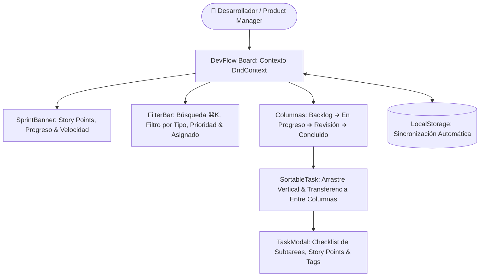

# DevFlow Kanban — Tablero Ágil de Gestión de Proyectos

<div align="center">


**Tablero interactivo de gestión ágil de proyectos y sprints inspirado en Linear y GitHub Projects con arrastre fluido Drag & Drop (@dnd-kit), Story Points Fibonacci y persistencia local.**

[🚀 Demo en Vivo](https://alxnrocha.github.io/kanban-board/) • [📂 Repositorio en GitHub](https://github.com/alxnrocha/kanban-board)

</div>

---

## 🏛️ Arquitectura y Flujo de Interacción



---

## ✨ Características Principales

- **Motor Drag & Drop (@dnd-kit):** Movimiento fluido de tarjetas entre columnas y reordenamiento vertical con elevación visual (`DragOverlay`) y sensores accesibles.
- **Resumen del Sprint en Vivo:** Cálculo de métricas (Tareas totales, completadas, Story Points acumulados `89/120` y barra de progreso porcentual).
- **Gestión de Tareas y Subtareas:** Tipos (`Feature`, `Bug`, `Task`, `Refactor`), prioridades (`Urgente`, `Alta`, `Media`, `Baja`), Story Points y checklist interactivo.
- **Búsqueda Rápida & Filtros:** Búsqueda en tiempo real con atajo de teclado (`⌘K` / `Ctrl+K`) y filtros rápidos por etiquetas y asignados.
- **Navegación Móvil Adaptativa:** Selector horizontal de columnas para pantallas pequeñas y controles táctiles optimizados.

---

## 🗂️ Estructura del Proyecto

```text
10-kanban-board/
├── index.html
├── src/
│   ├── components/                # KanbanBoard, Column, TaskCard, TaskModal, SprintBanner
│   ├── types/                     # Tipos TypeScript para tareas y columnas
│   ├── App.tsx                    # Componente raíz con estado de tablero
│   └── main.tsx                   # Entrada principal React 19
├── package.json
├── tsconfig.json
└── vite.config.ts
```

---

## 🚀 Instalación y Puesta en Marcha

### Prerrequisitos

- Node.js `>= 20.0.0`
- npm `>= 10.0.0`

### Ejecución Local

```bash
# 1. Clonar el repositorio
git clone https://github.com/alxnrocha/kanban-board.git
cd kanban-board

# 2. Instalar dependencias
npm install

# 3. Iniciar servidor de desarrollo
npm run dev

# 4. Compilar para producción
npm run build
```

---

## 🛠️ Tecnologías Utilizadas

| Capa            | Tecnología      | Aspectos Clave                                                 |
| --------------- | --------------- | -------------------------------------------------------------- |
| **Framework**   | React 19        | Hooks de estado y optimización de renderizado de columnas      |
| **Lenguaje**    | TypeScript 5.8  | Tipado estricto para entidades de sprint, tareas y eventos dnd |
| **Drag & Drop** | @dnd-kit        | Sensores de puntero y teclado, colisiones ortogonales          |
| **Estilos**     | Tailwind CSS v4 | Obsidian Dark / Modern Slate theme con micro-animaciones       |
| **Bundler**     | Vite 6.0        | Compilación ultrarrápida y optimización para web               |
| **Despliegue**  | GitHub Pages    | Despliegue estático continuo y optimizado                      |

---

<div align="center">
  <sub>Desarrollado con dedicación por <a href="https://github.com/alxnrocha">Alex Rocha</a> • Proyecto 10 del Portafolio Profesional Frontend.</sub>
</div>
