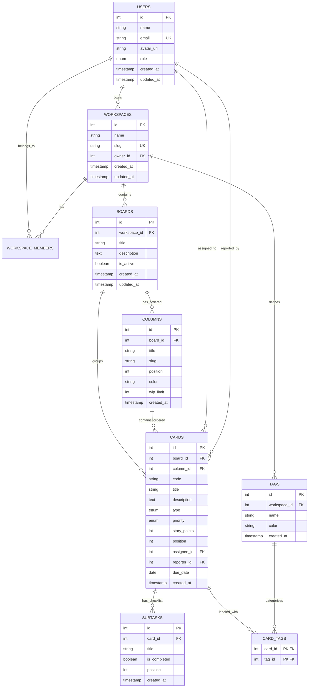

# Modelo de Datos Relacional (MySQL 8.4 LTS) — DevFlow Kanban

Este directorio contiene la definición completa de la base de datos relacional que sustenta la arquitectura de **DevFlow Kanban**, diseñada y optimizada para **MySQL 8.4 LTS**.

---

## 📊 Diagrama Entidad-Relación (ERD)



---

## 🗄️ Estructura de Tablas y Entidades

1. **`users`**: Miembros de la organización y desarrolladores del equipo.
2. **`workspaces`**: Espacios de trabajo que agrupan tableros, miembros y etiquetas globales.
3. **`workspace_members`**: Tabla asociativa con control de roles por espacio (`owner`, `admin`, `member`).
4. **`boards`**: Tableros de Sprint o flujos específicos asociados a un workspace.
5. **`columns`**: Estados del flujo Kanban con control de posición (`position`), color identificador y límite opcional de trabajo en curso (`wip_limit`).
6. **`cards`**: Tarjetas de tareas técnicas con código (`DEV-101`), tipo (`feature`, `bug`, `refactor`, `docs`, `spike`), prioridad (`urgent`, `high`, `medium`, `low`), estimación en story points (Fibonacci) y posición vertical.
7. **`subtasks`**: Lista interactiva de verificación asociada a cada tarjeta.
8. **`tags`**: Etiquetas de taxonomía transversal por workspace (`Frontend`, `Backend`, `Performance`, etc.).
9. **`card_tags`**: Tabla intermedia N:M entre tarjetas y etiquetas.

---

## ⚡ Índices y Rendimiento

- **Índices compuestos de ordenamiento:** `idx_cards_column_position (column_id, position)` y `idx_columns_board_position (board_id, position)` para optimizar consultas de renderizado instantáneo del tablero sin sorting en memoria.
- **Índices de filtrado:** `idx_cards_priority` e `idx_cards_type` para acelerar el filtrado reactivo multi-criterio.
- **Claves foráneas con borrado en cascada:** Garantiza integridad referencial automática al eliminar tarjetas (se eliminan sub-tareas y relaciones de tags asociadas).

---

## 🚀 Uso e Inicialización

```bash
# Crear base de datos y esquema
mysql -u root -p < database/schema.sql

# Poblar con datos de prueba
mysql -u root -p < database/seed.sql
```
